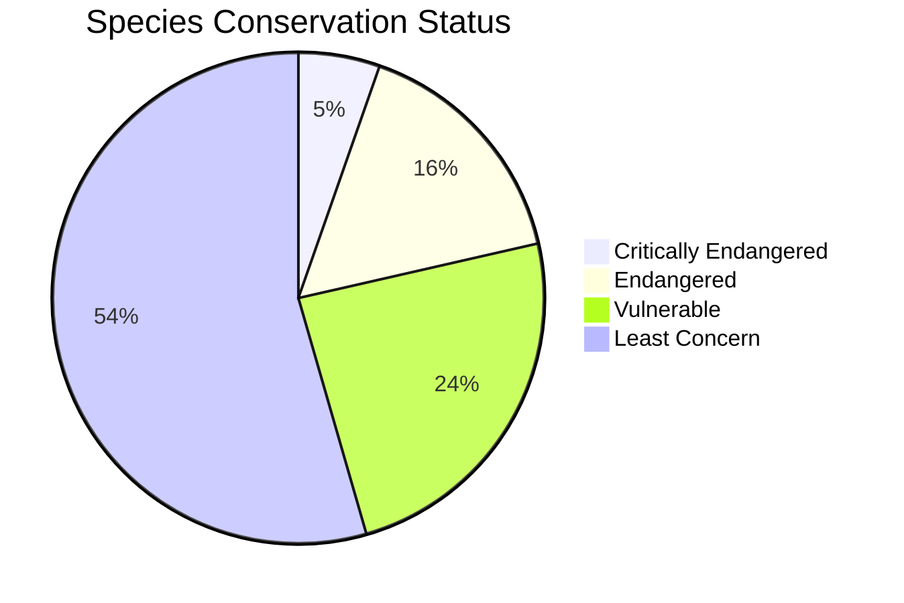

<div align="center">
<h1>🌿 Wildlife Conservation Web App</h1>

</div>

[](#)  
[](#)  
[](#)  
[](https://wildlife-demo.vercel.app)  
[](https://github.com/your-user/wildlife)

---

## 📖 Table of Contents

- [✨ Overview](#-overview)
- [🚀 Demo](#-demo)
- [⚡ Features](#-features)
- [🗂️ Architecture](#-architecture)
- [📊 Data Overview](#-data-overview)
- [📸 Screenshots](#-screenshots)
- [🛠️ Development](#-development)
- [📦 Project Structure](#-project-structure)
- [🤝 Contributing](#-contributing)
- [📜 License](#-license)
- [🎉 Acknowledgements](#-acknowledgements)

---

## ✨ Overview

The **Wildlife** project is a modern, immersive web experience that showcases global wildlife conservation initiatives. Built with **React 19**, **Vite 7**, **TypeScript 5**, **Tailwind 4**, and **Framer Motion**, the site presents:

- Real‑time live‑cam feeds of protected habitats
- Interactive species catalog with status indicators
- Data‑driven breeding and restoration program visualisations
- Minimalist informational pages (Contact, Newsletter, Social, Membership, Donate)
- A glass‑morphic UI using the OKLCH colour palette for a sleek, futuristic look

All heavy background animations have been disabled for a jitter‑free experience.

---

## 🚀 Demo

<div align="center">
  <a href="https://wildlife-demo.vercel.app" target="_blank">
    
  </a>
</div>

*Click the image to open the live demo.*

---

## ⚡ Features

- ✅ **Live‑Cam Section** – Optimised thumbnail rendering with memoised bokeh positions to eliminate jitter.
- ✅ **Glass‑Morphic UI** – Subtle motion, translucent surfaces, and OKLCH‑based theming.
- ✅ **Data‑Rich Visualisations** – Progress bars, radial gradients, colour‑coded status tags.
- ✅ **Responsive Layout** – Mobile‑first design with Tailwind utilities.
- ✅ **Strict TypeScript** – `noUnusedLocals`, `noUnusedParameters`, and explicit typing throughout.
- ✅ **Zero‑Jitter Experience** – All heavy background effects disabled.

---

## 🗂️ Architecture

<details open>
<summary>Click to expand</summary>

```mermaid
flowchart TD
    subgraph Client[Client (Browser)]
        direction TB
        A[React App] --> B[Components]
        B --> C[LiveCamsSection]
        B --> D[SpeciesList]
        B --> E[BreedingPrograms]
        B --> F[HabitatRestoration]
        B --> G[FieldResearch]
        B --> H[Pages: Contact, Newsletter, Social, Membership, Donate]
    end
    subgraph Server[Development / Build]
        I[Vite Dev Server] --> A
        J[TypeScript Compiler] --> A
    end
    style Client fill:#f0f8ff,stroke:#333,stroke-width:2px
    style Server fill:#fff0f5,stroke:#333,stroke-width:2px
```

</details>

---

## 📊 Data Overview (Sample Graphs)

<details>
<summary>Click to view diagrams</summary>



```mermaid
quadrantChart
    title Project Progress
    x-axis Low Progress --> High Progress
    y-axis Low Impact --> High Impact
    quadrant-1 "High Impact / High Progress" : 4
    quadrant-2 "High Impact / Low Progress" : 2
    quadrant-3 "Low Impact / Low Progress" : 1
    quadrant-4 "Low Impact / High Progress" : 0
```

</details>

---

## 📸 Screenshots

| Home | Species List |
|------|--------------|
|  |  |
| Live Cams | Breeding Programs |
|  |  |

---

## 🛠️ Development

```bash
# Install dependencies
npm ci

# Run the development server (http://localhost:3000)
npm run dev

# Build for production
npm run build

# Preview the production build
npm run preview
```

The app uses **TailwindCSS** for styling. To customise the colour palette edit `tailwind.config.cjs`.

---

## 📦 Project Structure

```text
src/
├─ components/                # UI components & sections
│   ├─ LiveCamsSection.tsx
│   ├─ SpeciesList.tsx
│   ├─ BreedingPrograms.tsx
│   ├─ HabitatRestoration.tsx
│   ├─ FieldResearch.tsx
│   ├─ Navigation.tsx
│   ├─ CustomCursor.tsx
│   └─ …
├─ pages/ (optional)          # Future Next.js‑style page routes
├─ assets/                    # Images, SVGs, icons
│   └─ screenshots/           # Store screenshots for README
├─ lib/                       # Utilities, types, helpers
├─ App.tsx                    # Root component
└─ index.tsx                  # React entry point
```

---

## 🤝 Contributing

1. Fork the repository.
2. Create a feature branch:
   ```bash
   git checkout -b feature/awesome-feature
   ```
3. Install dependencies and run tests (if any).
4. Submit a pull request with a clear description of your changes.
5. Ensure `npm run build` passes without errors.

<a href="https://github.com/your-user/wildlife/graphs/contributors">
  
</a>

---

## 📜 License

This project is licensed under the **MIT License** – see the `LICENSE` file for details.

---

## 🎉 Acknowledgements

- **Lucide Icons** – for the clean, open‑source icon set.
- **Framer Motion** – for effortless animations.
- **Tailwind Labs** – for the utility‑first CSS framework.
- **Vite** – for lightning‑fast dev server and bundling.
- **OpenAI & Claude** – for assistance in building and polishing the codebase.

---

<div align="center">
  <a href="https://wildlife-demo.vercel.app"></a>
</div>

*Happy coding, and thank you for supporting wildlife conservation!*

[](#)  
[](#)  
[](#)

---

## ✨ Overview

The **Wildlife** project is a modern, immersive web experience that showcases global wildlife conservation initiatives. Built with **React 19**, **Vite 7**, **TypeScript 5**, **Tailwind 4**, and **Framer Motion**, the site presents:

- Real‑time live‑cam feeds of protected habitats
- Interactive species catalog with status indicators
- Data‑driven breeding and restoration program visualisations
- Minimalist informational pages (Contact, Newsletter, Social, Membership, Donate)
- A glass‑morphic UI using the OKLCH colour palette for a sleek, futuristic look

All heavy background animations have been disabled for a jitter‑free experience.

---

## 📸 Screenshots

> *(Replace the placeholders with actual screenshots once the app is running)*

| Home | Species List |
|------|--------------|
|  |  |
| Live Cams | Breeding Programs |
|  |  |

---

## 🚀 Features

- **Live‑Cam Section** – Optimised thumbnail rendering with memoised bokeh positions to eliminate jitter.
- **Animated Yet Performant UI** – Glass‑morphic components, subtle motion, and disabled heavy background effects.
- **Data‑Rich Visualisations** – Progress bars, radial gradients, and colour‑coded status tags.
- **Responsive Layout** – Mobile‑first design with Tailwind utilities.
- **Full TypeScript Strictness** – `noUnusedLocals`, `noUnusedParameters`, and explicit typing throughout the codebase.
- **Bottom‑Nav (removed)** – Previously provided quick access to auxiliary pages; now optional.

---

## 🗂️ Architecture

```mermaid
flowchart TD
    subgraph Client[Client (Browser)]
        direction TB
        A[React App] --> B[Components]
        B --> C[LiveCamsSection]
        B --> D[SpeciesList]
        B --> E[BreedingPrograms]
        B --> F[HabitatRestoration]
        B --> G[FieldResearch]
        B --> H[Pages: Contact, Newsletter, Social, Membership, Donate]
    end
    subgraph Server[Development / Build]
        I[Vite Dev Server] --> A
        J[TypeScript Compiler] --> A
    end
    style Client fill:#f0f8ff,stroke:#333,stroke-width:2px
    style Server fill:#fff0f5,stroke:#333,stroke-width:2px
```

---

## 📊 Data Overview (Sample Graphs)

Below are placeholder SVGs that represent the statistical dashboards shown on the site. Replace them with generated charts using your preferred charting library (e.g., Recharts, Chart.js).


```mermaid
quadrantChart
    title Project Progress
    x-axis Low Progress --> High Progress
    y-axis Low Impact --> High Impact
    quadrant-1 "High Impact / High Progress" : 4
    quadrant-2 "High Impact / Low Progress" : 2
    quadrant-3 "Low Impact / Low Progress" : 1
    quadrant-4 "Low Impact / High Progress" : 0
```

---

## 🛠️ Development

```bash
# Install dependencies
npm ci

# Run the development server (http://localhost:3000)
npm run dev

# Build for production
npm run build

# Preview the production build
npm run preview
```

The app uses **TailwindCSS** for styling. To customise the colour palette edit `tailwind.config.cjs`.

---

## 📦 Project Structure

```text
src/
├─ components/                # UI components & sections
│   ├─ LiveCamsSection.tsx
│   ├─ SpeciesList.tsx
│   ├─ BreedingPrograms.tsx
│   ├─ HabitatRestoration.tsx
│   ├─ FieldResearch.tsx
│   ├─ Navigation.tsx
│   ├─ CustomCursor.tsx
│   └─ …
├─ pages/ (optional)          # Future Next.js‑style page routes
├─ assets/                    # Images, SVGs, icons
│   └─ screenshots/           # Store screenshots for README
├─ lib/                       # Utilities, types, helpers
├─ App.tsx                    # Root component
└─ index.tsx                  # React entry point
```

---

## 🤝 Contributing

1. Fork the repository.
2. Create a feature branch:
   ```bash
   git checkout -b feature/awesome-feature
   ```
3. Install dependencies and run tests (if any).
4. Submit a pull request with a clear description of your changes.
5. Ensure `npm run build` passes without errors.

---

## 📜 License

This project is licensed under the **MIT License** – see the `LICENSE` file for details.

---

## 🎉 Acknowledgements

- **Lucide Icons** – for the clean, open‑source icon set.
- **Framer Motion** – for effortless animations.
- **Tailwind Labs** – for the utility‑first CSS framework.
- **Vite** – for lightning‑fast dev server and bundling.
- **OpenAI & Claude** – for assistance in building and polishing the codebase.

---

*Happy coding, and thank you for supporting wildlife conservation!*